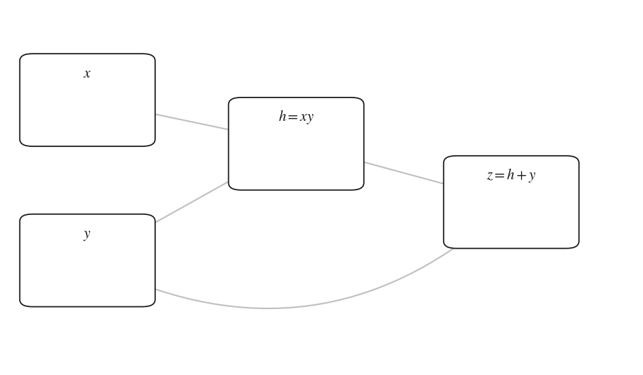

# autograd-from-scratch

[](https://github.com/krrpranavv/autograd-from-scratch/actions/workflows/tests.yml)
[](LICENSE)
[](pyproject.toml)

I built this to understand what `loss.backward()` actually does. It is a small
automatic differentiation engine in plain NumPy: Karpathy's scalar
[micrograd](https://github.com/karpathy/micrograd) reimplemented first, then the
same idea lifted to arrays, then the things I got curious about after that:
forward mode, exact second derivatives, differentiating through an optimizer's
solution, and Hessian-vector products. A small MLP and a tiny GPT train on it.
PyTorch appears only in the tests, as a reference to check gradients against.

<p align="center"></p>
<p align="center"><em>an MLP learning a 2-class spiral. every gradient in every step comes from
this engine; <code>examples/record_training.py</code> reruns it.</em></p>

```python
import numpy as np
from autograd import Tensor, jvp, vjp

# reverse mode: build an expression, one backward() fills every gradient
a, b, c = Tensor(2.0), Tensor(-3.0), Tensor(10.0)
f = (a * b + c).tanh()
f.backward()
print(a.grad, b.grad, c.grad)   # -0.00402  0.00268  0.00134

# forward mode computes Jv; reverse mode computes J^T u; same Jacobian,
# evaluated from the two ends (section 4 of the guide proves they must agree)
g = lambda x: (x ** 2).sum()
x, v = np.array([1.0, 2.0]), np.array([3.0, 4.0])
print(jvp(g, x, v))      # 22.0    the directional derivative along v
print(vjp(g, x, 1.0))    # [2. 4.] the gradient: J^T u with u = 1
```

Reverse mode records each operation as you compute, then walks the graph
backward applying the chain rule, accumulating a gradient into every input. It
is cheap when there are few outputs and many inputs, which is what training is:
one scalar loss, many weights. Forward mode carries a derivative forward
alongside each value through the same local rules, and is cheap in the opposite
case. Everything in this repo is one of those two ideas, or the two composed.

<p align="center"></p>
<p align="center"><em>every number here is read off the engine's own graph;
<code>examples/record_backward.py</code> redraws it.</em></p>

## Quickstart

The only tool you need installed is [uv](https://docs.astral.sh/uv/)
(`brew install uv`, or the one-line installer on its site); it fetches
Python 3.12 and every dependency itself.

```bash
uv sync                        # numpy for the engine; torch and pytest for the tests
uv run python -m pytest -q     # gradient checks, the adjoint identity, second order

uv run python autograd/micrograd.py     # scalar engine, gradients worked out by hand
uv run python autograd/dual.py          # forward vs reverse: the adjoint identity
uv run python autograd/secondorder.py   # exact curvature, Newton vs gradient descent
uv run python autograd/implicit.py      # differentiate through an argmin
uv run python autograd/hvp.py           # Hessian-vector products without forming H
uv run python examples/train_mlp.py     # an MLP on a spiral
uv run python examples/train_gpt.py     # a tiny GPT, every gradient from the engine
uv run python autograd/viz.py           # draw the computation graph of an expression

uv run --group viz python examples/landscape.py   # curvature of the trained MLP
uv run --group viz python examples/benchmark.py   # forward vs reverse cost measurement
uv run --group viz python reproduce.py   # rerun everything, regenerate figures
```

## Working through it

[`walkthrough.ipynb`](walkthrough.ipynb) builds the scalar engine from nothing,
one checked step at a time; the outputs are saved, so it reads straight on
GitHub. [`GUIDE.md`](GUIDE.md) walks the real engine. [`challenge/`](challenge)
is the rebuild track: two skeleton files and checkpoint tests in build order,
where `uv run python -m pytest challenge -x` stops at exactly the next thing to
implement, and the checks are hand-computed numbers and finite differences, so
you never need PyTorch. Worked answers are in [`solutions/`](solutions), and
[`NOTES.md`](NOTES.md) is what building all of this broke and taught.

## Results

Numbers from the current code; `reproduce.py` reruns all of them.

- Per-op reverse-mode gradients match PyTorch to 1e-7, and a separate
  finite-difference check needs no framework at all (`tests/test_engine.py`).
- Forward and reverse mode agree as adjoints: $\langle u, Jv \rangle = \langle J^\top u, v \rangle$ to 1e-10,
  and full Jacobians built column-wise (forward) and row-wise (reverse) match
  (`tests/test_dual.py`).
- Second derivatives match PyTorch's double-backward to 1e-8. Newton's method
  with exact curvature reaches the minimum of a smooth bowl in about 4 steps;
  gradient descent at learning rate 0.1 takes 50 (`autograd/secondorder.py`).
- Implicit differentiation through an argmin matches the closed-form ridge
  derivative to about 1e-16 (`autograd/implicit.py`).
- Hessian-vector products, computed forward-over-reverse without building the
  Hessian, match an explicitly assembled Hessian to about 4e-16 (`autograd/hvp.py`).
- The MLP reaches 99.5% on a two-class spiral; the GPT drives its loss from
  3.15 to 0.0002 and reproduces its training text exactly (`examples/train_gpt.py`).
- The trained MLP's loss, as a function of all 1218 parameters, has top
  Hessian eigenvalue about 11.8, measured with the engine's own Hessian-vector
  products (`examples/landscape.py`); [section 8 of the guide](GUIDE.md#8-curvature-of-the-trained-network-exampleslandscapepy)
  shows the resulting loss-landscape slice.

## Files

| Path | What it is |
|------|------------|
| **[`autograd/`](autograd/) — the engine** | |
| [`micrograd.py`](autograd/micrograd.py) | Scalar reverse-mode autograd (Karpathy's micrograd, reimplemented) |
| [`engine.py`](autograd/engine.py) | The tensor engine: reverse mode on NumPy arrays, broadcasting-aware backward |
| [`dual.py`](autograd/dual.py) | Forward mode: dual numbers, `jvp`/`vjp`/`jacobian`, the adjoint check |
| [`secondorder.py`](autograd/secondorder.py) | Order-2 duals: exact second derivatives, dense Hessian, Newton |
| [`implicit.py`](autograd/implicit.py) | Implicit differentiation: gradients through an argmin |
| [`hvp.py`](autograd/hvp.py) | Hessian-vector products (Pearlmutter), top eigenvalue, Newton-CG |
| [`nn.py`](autograd/nn.py) | Linear, Embedding, LayerNorm, Adam, SGD, built on the engine |
| [`viz.py`](autograd/viz.py) | Renders a computation graph (values and grads) to SVG |
| **[`examples/`](examples/) — things the engine does** | |
| [`train_mlp.py`](examples/train_mlp.py) | An MLP on a spiral |
| [`train_gpt.py`](examples/train_gpt.py) | A small causal Transformer, trained end to end ([gpt-from-scratch](https://github.com/krrpranavv/gpt-from-scratch) explains the architecture) |
| [`landscape.py`](examples/landscape.py) | Curvature of the trained MLP via the engine's own Hv |
| [`benchmark.py`](examples/benchmark.py) | Forward vs reverse cost of a full Jacobian, measured |
| [`figures.py`](examples/figures.py) | Regenerates the explainer diagrams in `assets/` |
| [`record_training.py`](examples/record_training.py) · [`record_backward.py`](examples/record_backward.py) | Render the README's gifs |
| **Learning materials** | |
| [`walkthrough.ipynb`](walkthrough.ipynb) | Build the scalar engine from nothing, step by step |
| [`GUIDE.md`](GUIDE.md) | The guide: hand traces, exercises, what broke, glossary |
| [`challenge/`](challenge/) | Rebuild the engine yourself against checkpoint tests |
| [`solutions/`](solutions/) | Worked answers and hints for the exercises |
| [`NOTES.md`](NOTES.md) | What building this taught me, and what is verified against what |
| **Verification** | |
| [`tests/`](tests/) | Per-op checks vs PyTorch, finite differences, the adjoint identity |
| [`reproduce.py`](reproduce.py) | One command: tests, every demo, every figure |

## The guide

[`GUIDE.md`](GUIDE.md), in the order the engine was built. Hand-traced backward
passes, the check behind every claim, what broke in each section, and exercises
with worked answers.

| Section | |
|---|---|
| [0 · The math you need](GUIDE.md#0-the-math-you-need) | derivative, gradient, Jacobian; the chain rule as a matmul |
| [1 · Reverse mode](GUIDE.md#1-reverse-mode-the-chain-rule-backward-autogradmicrogradpy-autogradenginepy) | the closure pattern, the backward walk, a graph traced by hand |
| [2 · Broadcasting](GUIDE.md#2-broadcasting-where-tensor-gradients-go-wrong) | where tensor gradients go wrong, and how `_unbroadcast` undoes it |
| [3 · Forward mode](GUIDE.md#3-forward-mode-autograddualpy) | dual numbers, `jvp`, the measured forward/reverse cost crossover |
| [4 · The adjoint identity](GUIDE.md#4-the-adjoint-identity-one-map-two-directions) | $\langle u, Jv \rangle = \langle J^\top u, v \rangle$, the strongest check in the repo |
| [5 · Second order](GUIDE.md#5-second-order-autogradsecondorderpy) | order-2 duals, exact Hessians, Newton vs gradient descent |
| [6 · Through an optimizer](GUIDE.md#6-differentiating-through-an-optimizer-autogradimplicitpy) | implicit differentiation: no unrolling, one linear solve |
| [7 · Hessian-vector products](GUIDE.md#7-hessian-vector-products-autogradhvppy) | Pearlmutter's trick as forward-over-reverse, Newton-CG |
| [8 · Curvature of the trained net](GUIDE.md#8-curvature-of-the-trained-network-exampleslandscapepy) | the loss valley: steep along the top eigenvector, flat elsewhere |
| [9 · The training loop](GUIDE.md#9-the-training-loop-autogradnnpy-examplestrain_mlppy-examplestrain_gptpy) | `zero_grad`, Adam matched to PyTorch step for step, the tiny GPT |

## Limitations

This is a float64 CPU engine written to be read, not to be fast. Nobody should
use it in place of PyTorch or JAX. The Newton optimizer is the raw
$x \leftarrow x - H^{-1}\nabla f$ and walks to saddle points as readily as to
minima. The power-iteration eigenvalue has no convergence check and can be
silently wrong when the extreme eigenvalues have equal magnitude. The curvature
measurement has only ever been run on a 1218-parameter network. None of the
techniques are new.

## Credit

The scalar engine is Andrej Karpathy's
[micrograd](https://github.com/karpathy/micrograd), reimplemented to understand
it. The tensor engine, forward mode, and the second-order parts grew out of
that. Pearlmutter (1994) for Hessian-vector products; Li et al. (2018) for the
idea of slicing loss landscapes.
