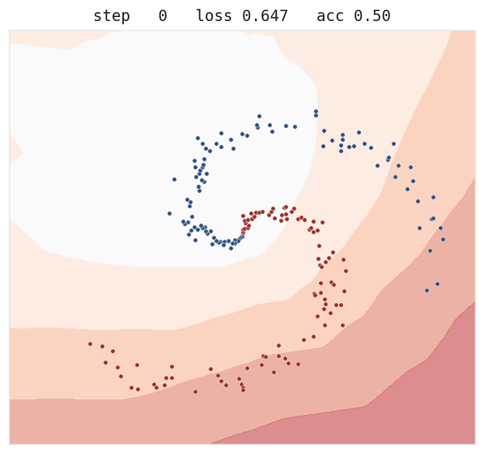

# autograd-from-scratch

[](https://github.com/krrpranavv/autograd-from-scratch/actions/workflows/tests.yml)
[](LICENSE)
[](pyproject.toml)

I built this to understand what `loss.backward()` actually does. It is a small
automatic differentiation engine in plain NumPy: Karpathy's scalar
[micrograd](https://github.com/karpathy/micrograd) reimplemented first, then the
same idea lifted to arrays, then the things I got curious about after that:
forward mode, exact second derivatives, differentiating through an optimizer's
solution, and Hessian-vector products. A small MLP and a tiny GPT train on it.
PyTorch appears only in the tests, as a reference to check gradients against.

<p align="center"></p>
<p align="center"><em>an MLP learning a 2-class spiral. every gradient in every step comes from
this engine; <code>examples/record_training.py</code> reruns it.</em></p>

```python
import numpy as np
from autograd import Tensor, jvp, vjp

# reverse mode: build an expression, one backward() fills every gradient
a, b, c = Tensor(2.0), Tensor(-3.0), Tensor(10.0)
f = (a * b + c).tanh()
f.backward()
print(a.grad, b.grad, c.grad)   # -0.00402  0.00268  0.00134

# forward mode computes Jv; reverse mode computes J^T u; same Jacobian,
# evaluated from the two ends (section 4 of the guide below proves they must agree)
g = lambda x: (x ** 2).sum()
x, v = np.array([1.0, 2.0]), np.array([3.0, 4.0])
print(jvp(g, x, v))      # 22.0    the directional derivative along v
print(vjp(g, x, 1.0))    # [2. 4.] the gradient: J^T u with u = 1
```

Reverse mode records each operation as you compute, then walks the graph
backward applying the chain rule, accumulating a gradient into every input. It
is cheap when there are few outputs and many inputs, which is what training is:
one scalar loss, many weights. Forward mode carries a derivative forward
alongside each value through the same local rules, and is cheap in the opposite
case. Everything in this repo is one of those two ideas, or the two composed.


<details>
<summary>Contents</summary>

- [Quickstart](#quickstart)
- [Learning from this repo](#learning-from-this-repo)
- [The guide](#the-guide)
  - [0. The math you need](#0-the-math-you-need)
  - [1. Reverse mode: the chain rule, backward](#1-reverse-mode-the-chain-rule-backward-autogradmicrogradpy-autogradenginepy)
  - [2. Broadcasting: where tensor gradients go wrong](#2-broadcasting-where-tensor-gradients-go-wrong)
  - [3. Forward mode](#3-forward-mode-autograddualpy)
  - [4. The adjoint identity: one map, two directions](#4-the-adjoint-identity-one-map-two-directions)
  - [5. Second order](#5-second-order-autogradsecondorderpy)
  - [6. Differentiating through an optimizer](#6-differentiating-through-an-optimizer-autogradimplicitpy)
  - [7. Hessian-vector products](#7-hessian-vector-products-autogradhvppy)
  - [8. Curvature of the trained network](#8-curvature-of-the-trained-network-exampleslandscapepy)
  - [9. The training loop](#9-the-training-loop-autogradnnpy-examplestrain_mlppy-examplestrain_gptpy)
- [Results](#results)
- [Files](#files)
- [Limitations](#limitations)
- [Credit](#credit)

</details>

## Quickstart

The only tool you need installed is [uv](https://docs.astral.sh/uv/)
(`brew install uv`, or the one-line installer on its site); it fetches
Python 3.12 and every dependency itself.

```bash
uv sync                        # numpy for the engine; torch and pytest for the tests
uv run python -m pytest -q     # gradient checks, the adjoint identity, second order

uv run python autograd/micrograd.py     # scalar engine, gradients worked out by hand
uv run python autograd/dual.py          # forward vs reverse: the adjoint identity
uv run python autograd/secondorder.py   # exact curvature, Newton vs gradient descent
uv run python autograd/implicit.py      # differentiate through an argmin
uv run python autograd/hvp.py           # Hessian-vector products without forming H
uv run python examples/train_mlp.py     # an MLP on a spiral
uv run python examples/train_gpt.py     # a tiny GPT, every gradient from the engine
uv run python autograd/viz.py           # draw the computation graph of an expression

uv run --group viz python examples/landscape.py   # curvature of the trained MLP
uv run --group viz python examples/benchmark.py   # forward vs reverse cost measurement
uv run --group viz python reproduce.py   # rerun everything, regenerate figures
```

## Learning from this repo

The code is one half; the other half is a set of materials for working through
it. They are meant to be used in roughly this order, but each stands on its
own.

### 1. [`walkthrough.ipynb`](walkthrough.ipynb), if autodiff is new to you

A notebook that builds a scalar autodiff engine from nothing, in the order the
ideas actually arrive: estimate a derivative by nudging a value, write a
`Value` class that only knows `+` and `*`, push gradients through a four-node
graph by hand, automate it with closures and a topological sort, hit the
classic gradient-overwrite bug and watch it give the wrong number, fix it, and
finish by training a three-neuron network whose loss visibly falls. Every step
is checked against the nudge estimate, so nothing has to be taken on faith.

The outputs are saved in the file, so you can read it straight on GitHub. To
run and edit it locally:

```bash
uv run --with notebook jupyter notebook walkthrough.ipynb
```

### 2. [The guide](#the-guide), the walkthrough of the real engine

Further down in this README: one section per idea, from reverse mode with a
fully hand-traced backward pass, through broadcasting, forward mode, and the
adjoint identity that ties the two modes together, to second order, implicit
differentiation, Hessian-vector products, the curvature of the trained
network, and the training loop itself.

Use it with the code open: run the script each section talks about, then read
the section, then read the source file.

### 3. [`challenge/`](challenge/), rebuild the engine yourself

The strongest way through this material is writing the engine against the same
tests that verify mine. The challenge directory has two skeleton files
(`engine_skeleton.py`, `dual_skeleton.py`) where every method states its
contract and raises `NotImplementedError`, plus checkpoint tests numbered in
build order: scalar ops, the backward walk, unbroadcasting, matmul, the
remaining ops, and finally forward mode plus the adjoint identity binding
your two engines together.

The loop is one command:

```bash
uv run python -m pytest challenge -x   # stops at exactly the next thing to implement
```

Implement the method it failed on, run it again, repeat. The checks are
framework-free (hand-computed numbers and finite differences), so you never
need PyTorch for this part. The rules and checkpoint list are in
[`challenge/README.md`](challenge/README.md). If you want to confirm the checkpoints themselves are
sound, `CHALLENGE_REFERENCE=1 uv run python -m pytest challenge -q` runs them
against the repo's real engine; all of them pass.

### 4. [`solutions/`](solutions/), when you are stuck or done

Worked answers, each with a try-first warning at the top:

- [`solutions/01_add_sin.md`](solutions/01_add_sin.md): adding a new op
  (`sin`) to all three classes, with the exact code and the checks to run
  against finite differences and the adjoint identity. This is the first
  exercise with a full solution; after it, "registering an op" in a real
  framework is no longer mysterious.
- [`solutions/02_break_newton.md`](solutions/02_break_newton.md): running
  Newton's method into a saddle point on purpose, why the Hessian explains
  it, and a damped fix.
- [`solutions/03_zero_grad.md`](solutions/03_zero_grad.md): what happens when
  you skip `zero_grad()`, and why gradient accumulation is correct within one
  backward pass but wrong across steps.
- [`solutions/README.md`](solutions/README.md): answers to the guide's
  warm-up exercises and sketches for the open ones (the condition-number
  sweep, measuring the GPT's curvature, an op-count version of the
  benchmark).

### 5. [`NOTES.md`](NOTES.md), the write-up

What I learned building each piece, in the order I built them: the bugs that
left regression tests behind (the cross-entropy clamp, the recursion limit,
the 0 times infinity NaN, conjugate gradient dying on a saddle), the benchmark
that refused to cross where the textbook argument said it would and why, and a
table of what is checked against what. Read it whenever; it pairs well with
the guide but assumes nothing from it.

## The guide

The guide walks the repo in the order it was built. Each section states the
idea, shows the minimal mechanism, names the check that verifies it, and notes
what broke while building it. Exercises are at the point where you have just
learned enough to do them.

What you need coming in: comfortable Python, the single-variable chain rule,
and a little linear algebra (matrix times vector). Section 0 builds the rest.
If autodiff is completely new, run [`walkthrough.ipynb`](walkthrough.ipynb) first; it constructs
the scalar engine one cell at a time.

Run the [Quickstart](#quickstart) commands up front so the outputs below are
real to you.

### 0. The math you need

A derivative measures sensitivity: nudge the input by $h$, the output moves by
about $f'(x) \cdot h$. Everything below is bookkeeping for that one idea.

For a function with several inputs, the gradient collects one sensitivity per
input: $\nabla f = (\partial f/\partial x_1, \ldots, \partial f/\partial x_n)$.

For a function with several inputs *and* several outputs, the sensitivities
form a matrix, the Jacobian: row $i$, column $j$ holds
$\partial(\text{output}_i) / \partial(\text{input}_j)$.
Worked example: $f(x, y) = (xy,\; x + y)$ has

$$J = \begin{pmatrix} y & x \\ 1 & 1 \end{pmatrix},
\qquad \text{at } (2, 3):\;
\begin{pmatrix} 3 & 2 \\ 1 & 1 \end{pmatrix}$$

The chain rule for composed functions is matrix multiplication of Jacobians:
$J_{g \circ f}(x) = J_g(f(x)) \cdot J_f(x)$. To see it once, feed the example
above into $g(u, v) = u + v$, so that $g(f(x, y)) = xy + x + y$. The Jacobian
of $g$ is the row $(1 \;\; 1)$, and at $(2, 3)$ the product is

$$(1 \;\; 1) \begin{pmatrix} 3 & 2 \\ 1 & 1 \end{pmatrix} = (4 \;\; 3)$$

which matches differentiating $xy + x + y$ directly:
$(y + 1,\; x + 1) = (4, 3)$. That is the whole secret of autodiff: every
program is a composition of small functions whose Jacobians we know, so its
derivative is a product of known matrices, and the two autodiff modes are just
the two sensible orders to multiply them in.


The Hessian $H$ is the matrix of second derivatives of a scalar function,
$H_{ij} = \partial^2 f / \partial x_i \partial x_j$. It describes curvature.
That is all of the second-order sections.

The [glossary](#glossary) at the end of this guide has one-line definitions
for every term used below.

### 1. Reverse mode: the chain rule, backward (`autograd/micrograd.py`, `autograd/engine.py`)

The question: given a value computed from inputs through many small
operations, fill in $\partial f / \partial(\text{input})$ for every input, in
one pass.

The mechanism: each `Value` (scalar) or `Tensor` (array) remembers which
operation produced it and stores a closure holding that operation's local
derivative. `backward()` topologically sorts the graph, seeds the output's
gradient with 1, and walks the order in reverse; each node passes gradient to
its inputs with `+=`. (The figure at the top of this README draws exactly
this.)

In symbols, with $\bar{x}$ for the gradient $\partial f / \partial x$ stored
on a node $x$: an operation $o = g(a, b)$ contributes

$$\bar{a} \;{+}{=}\; \bar{o} \cdot \frac{\partial o}{\partial a},
\qquad
\bar{b} \;{+}{=}\; \bar{o} \cdot \frac{\partial o}{\partial b}$$

That one local rule, applied in reverse topological order, is the entire
engine.

Trace it once by hand and the mystery goes. Take $f = \tanh(a \cdot b + c)$
with $a = 2$, $b = -3$, $c = 10$. Forward: $e = ab = -6$, $d = e + c = 4$,
$f = \tanh(4) = 0.999329$. Backward, node by node:

| node | local derivative | incoming grad | pushes to inputs |
|---|---|---|---|
| $f = \tanh(d)$ | $1 - \tanh^2(d) = 0.001341$ | $1$ | $d$: $0.001341$ |
| $d = e + c$ | $1$ for each input | $0.001341$ | $e$: $0.001341$, $c$: $0.001341$ |
| $e = a \cdot b$ | $b$ w.r.t. $a$; $a$ w.r.t. $b$ | $0.001341$ | $a$: $-0.004023$, $b$: $0.002682$ |

`autograd/viz.py` draws this exact graph with the values and gradients filled in, so
you can check the table against the picture:


And check it against the ground truth that needs no theory, nudging:

```python
import math
f = lambda a: math.tanh(a * -3.0 + 10.0)
h = 1e-6
print((f(2 + h) - f(2 - h)) / (2 * h))   # -0.004023..., matches the table
```

The `+=` matters. A value used in two places gets gradient from both paths;
plain assignment would keep only the last one and be silently wrong. The
worked example in `autograd/micrograd.py`'s `__main__` exercises exactly this (its `b`
feeds two different expressions), and the notebook shows the failure mode on
purpose.

The check: every op's gradient is compared against PyTorch at 1e-7, and a
separate finite-difference check repeats it with no framework
(`tests/test_engine.py`).

What broke: the first topological sort was recursive and died on a 5000-node
chain (Python's recursion limit). `backward()` is iterative for that reason,
and `test_backward_deep_graph_no_recursion_error` pins it.

A reading order for `autograd/engine.py`, if you read one method at a time: `__add__`
(the closure pattern), `backward` (the walk), `_unbroadcast` (next section),
`__matmul__` (the hardest local rule).

Exercise 1 (warm-up): on paper, predict all the gradients of
$g = \text{relu}(a \cdot b + a)$ at $a = 2$, $b = -3$, then build it with
`Tensor` and check with `backward()` and `viz.draw_dot`. Answer in
[`solutions/README.md`](solutions/README.md).

Exercise 2 (warm-up): call `backward()` twice on two graphs that share a leaf,
without zeroing the gradient in between. Explain the number you get. This is
why training loops call `zero_grad()` every step. Answer in
[`solutions/03_zero_grad.md`](solutions/03_zero_grad.md).

### 2. Broadcasting: where tensor gradients go wrong

NumPy silently stretches a `(C,)` bias to match a `(B, T, C)` activation in
the forward pass. (Shapes like this appear because tensor engines process a
whole batch at once: `B` examples, `T` positions in a sequence, `C` feature
channels.) The backward pass must undo the stretch: the gradient arriving at
the broadcast value has shape `(B, T, C)`, and the bias needs shape `(C,)`.
Undoing a broadcast means summing over the stretched axes, which is what
`_unbroadcast` does. (This undo-the-operation idea is the adjoint, which
Section 4 makes precise.)


See it fail: open `autograd/engine.py`, remove the `_unbroadcast` call from `__add__`'s
backward, and run

```bash
uv run python -m pytest tests/test_engine.py -k broadcast
```

The errors you get (shape mismatches and wrong gradients) are the errors every
from-scratch tensor engine has at some point. Put it back.

What broke here historically was cross-entropy rather than `_unbroadcast`
itself: an early version clamped shifted logits to dodge `exp` overflow, which
silently capped the loss at about 27.6 when the true value was 50. The
logsumexp form fixed it, and `test_cross_entropy_value_extreme_logits` keeps
it fixed. The lesson I took: numerical-stability hacks can pass every gradient
check and still be wrong in the forward value.

### 3. Forward mode (`autograd/dual.py`)

A `Dual` carries `(value, tangent)`, where the tangent is a directional
derivative, and pushes the tangent through the same local rules the reverse
engine uses. There is no graph and no reverse walk. One forward pass computes
the Jacobian-vector product $Jv$: how the outputs move if the inputs move in
direction $v$.

The arithmetic is exactly what $a + \epsilon\, a'$ with $\epsilon^2 = 0$
forces. Multiplication does the product rule by itself,

$$(a + \epsilon a')(b + \epsilon b') = ab + \epsilon\,(a b' + a' b)$$

and a unary op pushes the tangent through its local slope:
$g(a + \epsilon a') = g(a) + \epsilon\, g'(a)\, a'$.

The two modes therefore have opposite costs. A full Jacobian needs one forward
pass per input column (forward mode) or one backward pass per output row
(reverse mode). `examples/benchmark.py` measures this on the engine; one curve climbs
with the swept dimension while the other stays flat. On my machine the
crossover lands near twice the predicted $n = m$ point, because each reverse
pass also re-runs the graph-building forward pass, a constant the
pass-counting argument ignores. The asymptotics are the textbook ones; the
constant is honest.


### 4. The adjoint identity: one map, two directions

First, a bridge from what you already use. The `backward()` you call in
training is a special case: `backward(seed=u)` computes $J^\top u$, and the
everyday gradient is $u = 1$. Concretely:

```python
import numpy as np
from autograd.dual import vjp
from autograd.engine import Tensor

f = lambda x: (x ** 2).sum()
x = np.array([1.0, 2.0])
print(vjp(f, x, 1.0))          # [2. 4.]
xt = Tensor(x); f(xt).backward()
print(xt.grad)                  # [2. 4.], the same thing
```

So reverse mode computes $J^\top u$ and forward mode computes $Jv$. Two
directions of one linear map, which forces, for any $u$ and $v$:

$$\langle u,\; J v \rangle \;=\; \langle J^\top u,\; v \rangle$$

(The angle brackets are just the dot product: $\langle u, w \rangle$ is
`(u * w).sum()`.)


This identity is the strongest correctness check in the project, because it
needs no reference implementation: if the forward and reverse code disagree
anywhere, the two inner products separate immediately. `test_dual.py` requires
the gap below 1e-10 over repeated random draws; in practice it sits at
floating-point zero. `autograd/dual.py` also builds full Jacobians both ways (column by
column forward, row by row reverse) and compares them entry by entry.

Two notes on the road from here. You have now seen everything the
[`challenge/`](challenge/) checkpoints test, so if you want to rebuild the
engine yourself, this is the moment to fork off and come back. And Sections 5
to 8 are second-order material that Section 9 does not depend on: if you came
for backprop and training, you can jump straight to Section 9 and return to
the curvature sections later.

### 5. Second order (`autograd/secondorder.py`)

Carry a second tangent and the same machinery yields exact second
derivatives. The rule for a unary $g$ comes from differentiating the chain
rule once more. Write $h(s) = g(a(s))$:

$$h'(s) = g'(a)\,a'(s)
\qquad\Rightarrow\qquad
h''(s) = g''(a)\,a'(s)^2 + g'(a)\,a''(s)$$

which in `Dual2`'s notation is `t2 = g''(a) * t1**2 + g'(a) * t2`. Seed
`t1 = v` on a scalar function and the output's `t2` is the directional
curvature $v^\top H v$, with no step size and no subtraction error. A dense
Hessian for small problems follows from the polarization identity

$$H_{ij} = \tfrac{1}{2}\left(q(e_i + e_j) - q(e_i) - q(e_j)\right),
\qquad q(v) = v^\top H v$$

and Newton's method, $x \leftarrow x - H^{-1} \nabla f$, follows from that.
Run `autograd/secondorder.py`: on a smooth two-variable bowl, Newton is within 1e-14 of
the minimum in three or four steps, while gradient descent at a learning rate
of 0.1 takes 50 steps to reach 1e-9, because Newton rescales each direction by
its curvature.

The check: $v^\top H v$ and the assembled Hessian match PyTorch's
double-backward at 1e-8, and the Hessian comes out symmetric
(`tests/test_secondorder.py`).

What broke: `x**1` at `x = 0`. The coefficient $k(k-1)p^{k-2}$ is
$0 \cdot \infty$, which is NaN, so the power rule special-cases
$k \in \{0, 1\}$. The same latent bug sat unfired in the first-order classes
and was fixed there later. `test_dual2_pow_k1_second_deriv_zero_at_zero` is
the regression test.

Exercise 3: add `sin` to all three classes (`Tensor`, `Dual`, `Dual2`). You
need its value, first derivative, and second derivative, and you can check
your work against finite differences, the adjoint identity, and the
curvature-vs-PyTorch test, none of which you have to write. Full solution
with diffs in [`solutions/01_add_sin.md`](solutions/01_add_sin.md). After this you know what
"registering an op" is in a real framework.

### 6. Differentiating through an optimizer (`autograd/implicit.py`)

Let $x^\star(t) = \arg\min_x f(x, t)$. What is $dx^\star/dt$? My first
instinct was to unroll the optimizer and backpropagate through every step. No
unrolling is needed. At the optimum the gradient vanishes for every $t$:
$\nabla_x f(x^\star(t), t) = 0$. Differentiate that equation in $t$. Writing
$H_{xx}$ for the Hessian block $\partial^2 f / \partial x\,\partial x$ and
$H_{xt}$ for the mixed block $\partial^2 f / \partial x\,\partial t$:

$$H_{xx}\,\frac{dx^\star}{dt} + H_{xt} = 0
\;\Longrightarrow\;
\frac{dx^\star}{dt} = -H_{xx}^{-1} H_{xt}$$

One Hessian (Section 5 built it) and one linear solve, no matter how many
iterations the optimizer ran. This is the implicit function theorem, the same
mechanism behind deep equilibrium models and differentiable optimization
layers.

The check: on ridge regression, where $dx^\star/d\lambda$ has a closed form,
the two agree to about 1e-16; on a non-quadratic problem, implicit
differentiation matches finite differences of re-solved argmins at about
8e-12 (`tests/test_implicit.py`).

### 7. Hessian-vector products (`autograd/hvp.py`)

The Hessian of a real model is too big to form, but most second-order methods
only need $Hv$. Pearlmutter's trick:

$$H v = \left.\frac{d}{d\epsilon}\, \nabla f(x + \epsilon v)\right|_{\epsilon=0}$$

the derivative of the gradient along $v$, which is forward mode applied to
the output of reverse mode. The composition is direct in this engine: seed a
`Dual` whose primal is a reverse-mode `Tensor` and whose tangent is $v$. The
forward pass yields $\nabla f \cdot v$ as a graph-tracked scalar; backprop it
and $Hv$ appears in the input's gradient.


Note what was never written: a second-derivative rule for this path. `autograd/dual.py`
knows only first derivatives; reverse mode differentiates the tangent
computation a second time on its own.

The check: `hvp` matches the explicitly assembled Hessian times $v$ at about
4e-16, and matches `torch.autograd.functional.hvp`, which reaches $Hv$ by a
different composition (`tests/test_hvp.py`). The same `Hv` drives power
iteration for the top curvature eigenvalue and a matrix-free Newton-CG step.

What broke: on an indefinite problem ($f = x_0^2 - x_1^2$), plain conjugate
gradient divides by $d^\top H d = 0$ and goes NaN. Newton-CG truncates at
negative curvature (the Steihaug rule); `test_newton_cg_finite_on_indefinite`
covers the saddle.

Exercise 4: break Newton on purpose. Run `newton_minimize` (it lives in
`autograd/secondorder.py`) on
$f = x_0^2 - x_1^2$ and watch it head for the saddle. Explain why from the
Hessian, then fix it with damping ($H + \mu I$). Worked answer in
[`solutions/02_break_newton.md`](solutions/02_break_newton.md).

### 8. Curvature of the trained network (`examples/landscape.py`)

`examples/landscape.py` points the second-order tools at a real model: it writes the
trained MLP's loss as a function of its flat 1218-parameter vector and calls
the same `hvp`. Power iteration finds the top Hessian eigenvalue,
about 11.8 at the trained optimum. Slicing the loss along that eigenvector
versus a random unit direction shows a narrow valley: steep one way, almost
flat the other. In 1218 dimensions a random direction is nearly orthogonal to
the top eigenvector, which is what makes it a fair control.


The check on the method: `tests/test_landscape.py` compares parameter-space
`Hv` against a dense Hessian on a small network, and the power-iteration
eigenvalue against `np.linalg.eigvalsh`.

Exercise 5 (open): do the same for the GPT. Express `examples/train_gpt.py`'s loss as
a function of its parameter vector, measure its sharpness, or go further and
slice a 2-D landscape over the top two eigenvectors. Sketch in
[`solutions/README.md`](solutions/README.md).

### 9. The training loop (`autograd/nn.py`, `examples/train_mlp.py`, `examples/train_gpt.py`)

The loop in `examples/train_mlp.py` is the same loop as every PyTorch script:

```python
for step in range(400):
    logits = model(x)
    loss = cross_entropy(logits, y)
    opt.zero_grad()      # grads accumulate by design, so clear them
    loss.backward()      # fill every parameter's .grad
    opt.step()           # walk downhill
```


`zero_grad()` exists because of Section 1's `+=`: accumulation is correct
*within* one backward pass (a parameter feeding several ops must sum its
paths) and wrong *across* steps. Skip it and your gradients double; warm-up
exercise 2 has you observe this directly.

`opt.step()` is one of two updates. SGD walks straight downhill,
$\theta \leftarrow \theta - \eta\, \nabla_\theta L$ with learning rate $\eta$.
Adam keeps running averages of each gradient and its square, and rescales
every parameter's step by its own noise level:

$$m \leftarrow \beta_1 m + (1 - \beta_1)\, \nabla_\theta L,
\qquad
v \leftarrow \beta_2 v + (1 - \beta_2)\, (\nabla_\theta L)^2,
\qquad
\theta \leftarrow \theta - \eta\, \frac{\hat{m}}{\sqrt{\hat{v}} + \varepsilon}$$

with $\hat{m}, \hat{v}$ the bias-corrected averages.

`autograd/nn.py` holds the layers (Linear, Embedding, LayerNorm) and optimizers (Adam
with bias correction, SGD), each a few lines on top of the engine, each
checked against its PyTorch counterpart in `tests/test_nn.py` (Adam is matched
step for step for 20 steps). `examples/train_gpt.py` is a real decoder-only
Transformer: multi-head causal attention, pre-norm residual blocks, GELU MLP,
learned positional embeddings, small only in scale (one layer, width 32). The
architecture itself is not this repo's subject; it is the same model as
[minimal-gpt](https://github.com/krrpranav/minimal-gpt), which walks the
architecture line by line, so read that (or Karpathy's "Let's build GPT") if
attention is new to you. It memorizes one line of Shakespeare to loss 0.0002, which is
deliberate overfitting used as an end-to-end gradient check; in real training,
driving the loss to zero like this would be the thing you avoid. Both training
runs are asserted in `tests/test_integration.py`: the per-op tests check
single gradients, and these check that everything composes.

Exercise 6 (open): find where curvature stops paying. Vary the conditioning
of a quadratic and count Newton steps vs gradient-descent steps to fixed
accuracy. At what condition number does the gap explode, and at what size does
building $H$ stop being worth it?

Exercise 7 (open): replace the wall-clock benchmark with an op-count one
(count node constructions instead of milliseconds) so the forward/reverse
crossover becomes machine-independent.

### Rebuilding it yourself

The end of the guide is the other natural moment (besides Section 4's fork)
to rebuild the engine yourself against the same checkpoint tests; step 3 of
[Learning from this repo](#learning-from-this-repo) describes the loop, and
[`challenge/README.md`](challenge/README.md) has the rules.

### Glossary

| Term | Meaning |
|---|---|
| gradient | vector of sensitivities of one scalar output to each input |
| Jacobian $J$ | matrix of all output-to-input sensitivities, $J_{ij} = \partial y_i / \partial x_j$ |
| Hessian $H$ | matrix of second derivatives of a scalar function; curvature |
| tangent | the directional derivative a forward-mode value carries |
| cotangent / seed | the vector $u$ a reverse pass starts from at the output |
| JVP | Jacobian-vector product $Jv$; one forward-mode pass |
| VJP | vector-Jacobian product $J^\top u$; one reverse-mode pass |
| HVP | Hessian-vector product $Hv$; here, forward mode over reverse mode |
| adjoint | the transpose map; reverse mode is the adjoint of forward mode |
| topological order | node ordering where every node comes after its inputs |
| broadcasting | NumPy stretching small shapes to match large ones |
| unbroadcast | summing a gradient back down to the pre-broadcast shape |
| positive definite | $v^\top H v > 0$ for all $v \ne 0$; bowl-shaped curvature |
| power iteration | repeated $v \leftarrow Hv / \lVert Hv \rVert$ to find the top eigenvector |
| conjugate gradient | iterative solver for $Hp = b$ using only matrix-vector products |
| implicit function theorem | differentiating a solution through its optimality condition |
| logits | a model's raw output scores, one per class, before softmax |
| softmax | exponentiate logits and normalize, turning scores into probabilities |
| cross-entropy | the classification loss: negative log-probability of the correct class |
| learning rate | the step size multiplying the gradient in each update |
| embedding | a learned lookup table mapping a token id to a vector |
| LayerNorm | normalizes each vector to zero mean and unit variance, then rescales |
| residual connection | computing $x + f(x)$ so gradients can flow around $f$ |

## Results

Numbers from the current code; `reproduce.py` reruns all of them.

- Per-op reverse-mode gradients match PyTorch to 1e-7, and a separate
  finite-difference check needs no framework at all (`tests/test_engine.py`).
- Forward and reverse mode agree as adjoints: $\langle u, Jv \rangle = \langle J^\top u, v \rangle$ to 1e-10,
  and full Jacobians built column-wise (forward) and row-wise (reverse) match
  (`tests/test_dual.py`).
- Second derivatives match PyTorch's double-backward to 1e-8. Newton's method
  with exact curvature reaches the minimum of a smooth bowl in about 4 steps;
  gradient descent at learning rate 0.1 takes 50 (`autograd/secondorder.py`).
- Implicit differentiation through an argmin matches the closed-form ridge
  derivative to about 1e-16 (`autograd/implicit.py`).
- Hessian-vector products, computed forward-over-reverse without building the
  Hessian, match an explicitly assembled Hessian to about 4e-16 (`autograd/hvp.py`).
- The MLP reaches 99.5% on a two-class spiral; the GPT drives its loss from
  3.15 to 0.0002 and reproduces its training text exactly (`examples/train_gpt.py`).
- The trained MLP's loss, as a function of all 1218 parameters, has top
  Hessian eigenvalue about 11.8, measured with the engine's own Hessian-vector
  products (`examples/landscape.py`). Section 8 of the guide above shows the
  resulting loss-landscape slice.

## Files

| Path | What it is |
|------|------------|
| **[`autograd/`](autograd/) — the engine** | |
| [`micrograd.py`](autograd/micrograd.py) | Scalar reverse-mode autograd (Karpathy's micrograd, reimplemented) |
| [`engine.py`](autograd/engine.py) | The tensor engine: reverse mode on NumPy arrays, broadcasting-aware backward |
| [`dual.py`](autograd/dual.py) | Forward mode: dual numbers, `jvp`/`vjp`/`jacobian`, the adjoint check |
| [`secondorder.py`](autograd/secondorder.py) | Order-2 duals: exact second derivatives, dense Hessian, Newton |
| [`implicit.py`](autograd/implicit.py) | Implicit differentiation: gradients through an argmin |
| [`hvp.py`](autograd/hvp.py) | Hessian-vector products (Pearlmutter), top eigenvalue, Newton-CG |
| [`nn.py`](autograd/nn.py) | Linear, Embedding, LayerNorm, Adam, SGD, built on the engine |
| [`viz.py`](autograd/viz.py) | Renders a computation graph (values and grads) to SVG |
| **[`examples/`](examples/) — things the engine does** | |
| [`train_mlp.py`](examples/train_mlp.py) | An MLP on a spiral |
| [`train_gpt.py`](examples/train_gpt.py) | A small causal Transformer, trained end to end ([minimal-gpt](https://github.com/krrpranav/minimal-gpt) explains the architecture) |
| [`landscape.py`](examples/landscape.py) | Curvature of the trained MLP via the engine's own Hv |
| [`benchmark.py`](examples/benchmark.py) | Forward vs reverse cost of a full Jacobian, measured |
| [`figures.py`](examples/figures.py) | Regenerates the explainer diagrams in `assets/` |
| **Learning materials** | |
| [`walkthrough.ipynb`](walkthrough.ipynb) | Build the scalar engine from nothing, step by step |
| [The guide](#the-guide) (in this README) | The walkthrough: prerequisites, hand traces, exercises, glossary |
| [`challenge/`](challenge/) | Rebuild the engine yourself against checkpoint tests |
| [`solutions/`](solutions/) | Worked answers and hints for the exercises |
| [`NOTES.md`](NOTES.md) | What building this taught me, and what is verified against what |
| **Verification** | |
| [`tests/`](tests/) | Per-op checks vs PyTorch, finite differences, the adjoint identity |
| [`reproduce.py`](reproduce.py) | One command: tests, every demo, every figure |

## Limitations

This is a float64 CPU engine written to be read, not to be fast. Nobody should
use it in place of PyTorch or JAX. The Newton optimizer is the raw
$x \leftarrow x - H^{-1}\nabla f$ and walks to saddle points as readily as to
minima. The power-iteration eigenvalue has no convergence check and can be
silently wrong when the extreme eigenvalues have equal magnitude. The curvature
measurement has only ever been run on a 1218-parameter network. None of the
techniques are new.

## Credit

The scalar engine is Andrej Karpathy's
[micrograd](https://github.com/karpathy/micrograd), reimplemented to understand
it. The tensor engine, forward mode, and the second-order parts grew out of
that. Pearlmutter (1994) for Hessian-vector products; Li et al. (2018) for the
idea of slicing loss landscapes.
